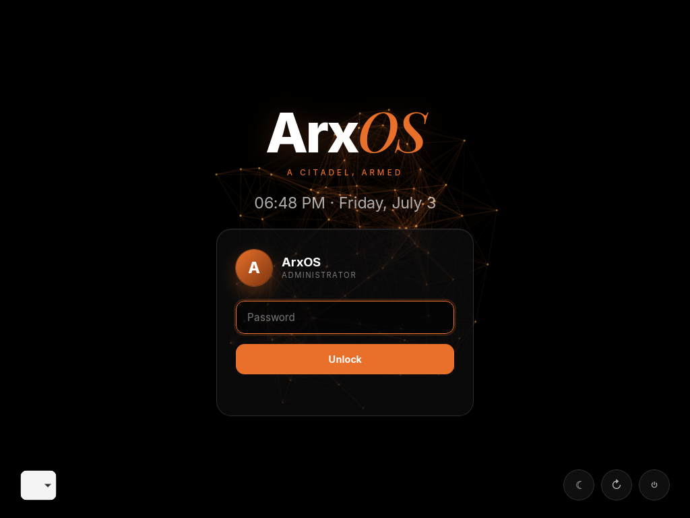
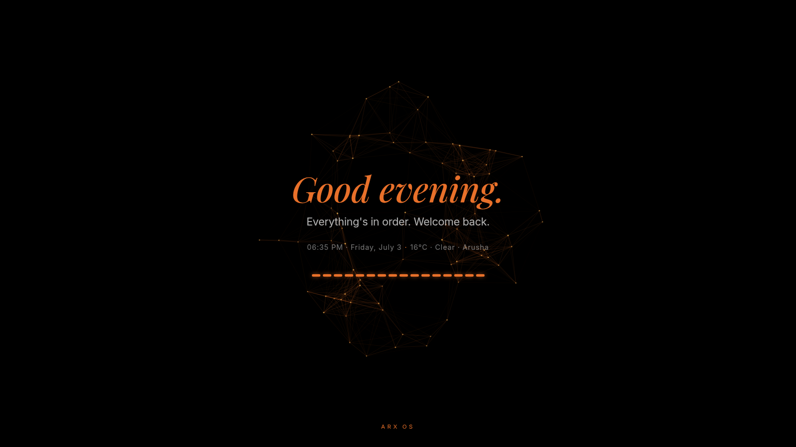

<div align="center">

# ArxOS Greeter

A LightDM greeter and post-login welcome splash for **ArxOS**, matching the ArxOS
site 100%: Inter + Playfair Display, the gold `#e8702a` accent, a dark canvas, an
animated **3D plexus**, and reveal animations. The greeter doubles as the lock
screen (via light-locker).

</div>



## What's inside

- **`themes/arxos/`** - a `lightdm-webkit2-greeter` theme (pure HTML/CSS/JS, no build).
  Animated 3D plexus background, a glass login card, session + power controls, a live
  clock. Wired to the LightDM webkit auth API (`authenticate → respond → login`).
- **`arxos-welcome`** - a post-login splash (WebKit2GTK). A JARVIS-toned, time-aware
  greeting with the live time, local weather, and a flat segmented (Plymouth-style)
  loader. Auto-closes after a few seconds.



## Install

```bash
sudo ./install.sh
```

Then log out or `systemctl restart lightdm`.

### Requirements

`lightdm`, `lightdm-webkit2-greeter`, `light-locker` (for the matching lock screen),
`python-gobject` + `webkit2gtk` (for the welcome splash), and the fonts **Inter**
(`inter-font`) and **Playfair Display** for the exact typography.

## Lock screen

With `light-locker` running in the session, locking (`xflock4`, or the panel's lock
action) switches to LightDM, so the **lock screen is the same greeter** - one design
for login and lock.

## License

MIT. Part of **ArxOS** (github.com/thearxos).
